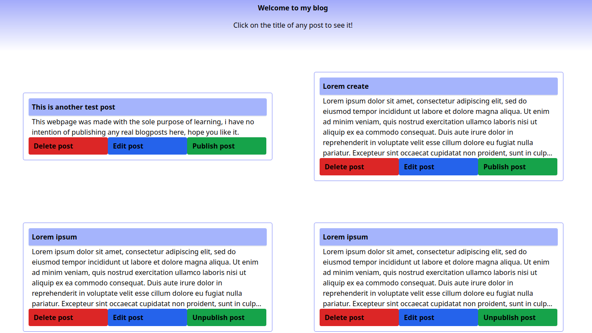
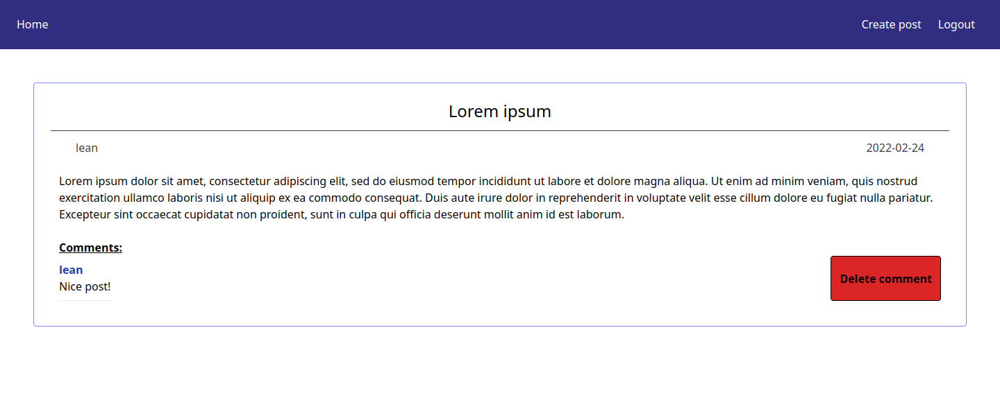
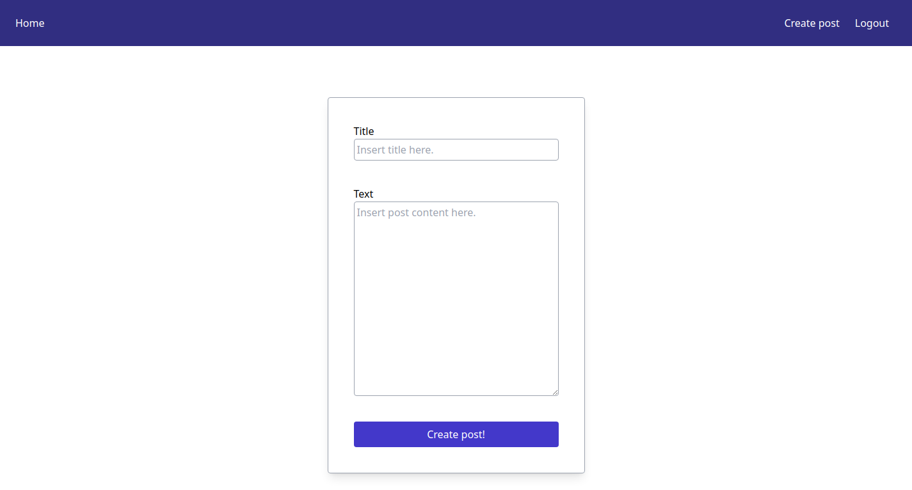

# Blog CMS project

Blog webpage CMS done consuming a MongoDB and Express REST API.

## How it looks

Homepage

Post detail

Create and edit post

## From The Odin Project's [curriculum](https://www.theodinproject.com/paths/full-stack-javascript/courses/nodejs/lessons/blog-api)

-[Link to API repo](https://github.com/leandrob0/blog-api)

-[Link to Client repo](https://github.com/leandrob0/blog-client)

## Built using 
* React
* Redux
* Tailwind